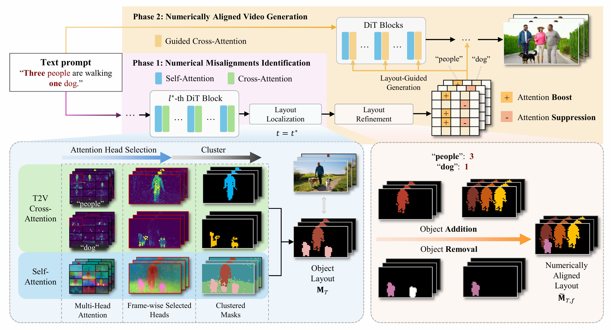

<div align="center">
  <h1>When Numbers Speak: Aligning Textual Numerals and <br> Visual Instances in Text-to-Video Diffusion Models</h1>


  <a href="https://arxiv.org/abs/2604.08546"></a> 
  <a href="https://h-embodvis.github.io/NUMINA"></a>
  <a href="https://opensource.org/licenses/MIT"></a>


[Zhengyang Sun](mailto:zysun@hust.edu.cn)<sup>1*</sup>, [Yu Chen](mailto:yuchen66@hust.edu.cn)<sup>1*</sup>, [Xin Zhou](https://lmd0311.github.io/)<sup>1,3</sup>, Xiaofan Li<sup>2</sup>, [Xiwu Chen](https://github.com/XiwuChen)<sup>3†</sup>, [Dingkang Liang](https://dk-liang.github.io/)<sup>1†</sup> and [Xiang Bai](https://scholar.google.com/citations?user=UeltiQ4AAAAJ&hl=en)<sup>1✉</sup>
 
  <sup>1</sup> Huazhong University of Science and Technology, <sup>2</sup> Zhejiang University, <sup>3</sup> Afari Intelligent Drive

(*) equal contribution, (†) project lead, (✉) corresponding author.
</div>

---
## TL;DR

NUMINA is a **training-free** framework that tackles **numerical misalignment** in text-to-video diffusion models — the persistent failure of T2V models to generate the correct count of objects specified in prompts (e.g., producing 2 or 4 cats when "three cats" is requested). Unlike seed search or prompt enhancement approaches that treat the generation pipeline as a black box and rely on brute-force resampling or LLM-based prompt rewriting, NUMINA directly identifies *where* and *why* counting errors occur inside the model by analyzing cross-attention and self-attention maps at selected DiT layers. It constructs a countable spatial layout via a two-stage clustering pipeline, then performs layout-guided attention modulation during regeneration to enforce the correct object count — all without retraining or fine-tuning. On our introduced CountBench, this attention-level intervention provides principled, interpretable control over numerical semantics that seed search and prompt enhancement fundamentally cannot achieve, improves counting accuracy by up to 7.4% on Wan2.1-1.3B. Furthermore, because NUMINA operates partly orthogonally to inference acceleration techniques, it is compatible with training-free caching methods such as [EasyCache](https://github.com/H-EmbodVis/EasyCache), which accelerates diffusion inference via runtime-adaptive transformer output reuse.

---
## Overview

<div align="center">

<p align="center">
  
</p>

<p align="center">

</div>

---
## Demo

<table>
  <thead>
    <tr>
      <th>Wan2.1-1.3B</th>
      <th>Ours</th>
      <th>Wan2.1-1.3B</th>
      <th>Ours</th>
    </tr>
  </thead>
  <tbody>
    <tr>
      <td align="center"></td>
      <td align="center"></td>
      <td align="center"></td>
      <td align="center"></td>
    </tr>
    <tr>
      <td colspan="2" align="center">
        <strong>Prompt 1:</strong> Two kittens playing with two yarn balls.
      </td>
      <td colspan="2" align="center">
        <strong>Prompt 2:</strong> Five explorers travelling through a dense jungle.
      </td>
    </tr>
  </tbody>
</table>

<table>
  <thead>
    <tr>
      <th>Ours</th>
      <th>Sora2</th>
      <th>Veo3.1</th>
      <th>Grok Imagine</th>
    </tr>
  </thead>
  <tbody>
    <tr>
      <td align="center"></td>
      <td align="center"></td>
      <td align="center"></td>
      <td align="center"></td>
    </tr>
    <tr>
      <td colspan="4" align="center">
        <strong>Prompt 3:</strong> Three cyclists ride through a trail with three mountain goats.
      </td>
    </tr>
  </tbody>
</table>

---

## Installation

NUMINA is implemented as a lightweight add-on to [Wan2.1](https://github.com/Wan-Video/Wan2.1). You can set up the environment and integrate the modules by running the following commands:

```bash
# Clone Wan2.1 repo
git clone https://github.com/Wan-Video/Wan2.1.git
cd Wan2.1

# From within the Wan2.1 root directory
git clone https://github.com/H-EmbodVis/NUMINA.git numina_repo
# Copy NUMINA modules
cp -r numina_repo/numina  ./numina
# Apply modifications to Wan2.1 files
cp numina_repo/wan/modules/attention.py  ./wan/modules/attention.py
cp numina_repo/wan/modules/model.py      ./wan/modules/model.py
cp numina_repo/wan/text2video.py         ./wan/text2video.py
cp numina_repo/generate.py               ./generate.py

# install dependencies
pip install -r numina_repo/requirements.txt
```

> Please follow the [Wan2.1 README](https://github.com/Wan-Video/Wan2.1#installation) for model checkpoint downloads and any platform-specific setup (e.g., FlashAttention).


---

## Project Structure

```
Wan2.1/
├── ...
├── numina/                          # NUMINA modules (new)
│   ├── __init__.py
│   ├── config.py                    # All hyperparameters
│   ├── token_mapper.py              # Nouns → T5 token index mapping
│   ├── head_selection.py            # attention head scoring
│   ├── layout.py                    # MeanShift + DBSCAN layout pipeline
│   └── modulation.py                # Cross-attention bias for SDPA
├── wan/
│   ├── ...
│   ├── modules/
│   │   ├── ...
│   │   ├── attention.py             # Modified: extraction + modulation paths
│   │   └── model.py                 # Modified: NUMINA state propagation
│   └── text2video.py                # Modified: two-phase pipeline
└── generate.py                      # Modified: --numina CLI arguments
```

**Modified Wan2.1 files** (4 files):
- `wan/modules/attention.py` — Added manual attention for extraction + SDPA for modulation
- `wan/modules/model.py` — Added NUMINA state management and routing
- `wan/text2video.py` — Added `generate_numina()` two-phase pipeline with [EasyCache](https://github.com/H-EmbodVis/EasyCache) integrated
- `generate.py` — Added NUMINA CLI arguments

---

## Quick Start

### Basic usage

```bash
python generate.py \
  --task t2v-1.3B \
  --ckpt_dir /path/to/Wan2.1-T2V-1.3B \
  --prompt "Three men are walking in the park." \
  --numina \
  --numina_noun_counts '{"men": 3}' \
  --size 832*480
```

### NUMINA-specific arguments

| Argument | Default | Description |
|----------|---------|-------------|
| `--numina` | `False` | Enable NUMINA numerical alignment |
| `--numina_noun_counts` | (required) | JSON dict, e.g. `'{"cats": 3, "dogs": 2}'` |
| `--numina_reference_step` | `20` | Denoising steps for pre-generation |
| `--numina_reference_layer` | `15` | DiT layer for attention extraction |

> For all other arguments (`--offload_model`, `--t5_cpu`, `--sample_guide_scale`, `--base_seed`, etc.), please refer to the [Wan2.1 documentation](https://github.com/Wan-Video/Wan2.1#usage).

---


## Acknowledgements

This project is built on top of [Wan2.1](https://github.com/Wan-Video/Wan2.1) by the Alibaba Wan Team.  
Phase 1 pre-generation acceleration uses the [EasyCache](https://github.com/H-EmbodVis/EasyCache) runtime-adaptive caching strategy.

---

## Citation
If you find this repository useful in your research, please consider giving us a star ⭐ and a citation.
```bibtex
@inproceedings{sun2026numina,
      title={When Numbers Speak: Aligning Textual Numerals and Visual Instances in Text-to-Video Diffusion Models},
      author={Sun, Zhengyang and Chen, Yu and Zhou, Xin and Li, Xiaofan and Chen, Xiwu and Liang, Dingkang and Bai, Xiang},
      booktitle={Proc. of IEEE Intl. Conf. on Computer Vision and Pattern Recognition},
      year={2026}
}
```
